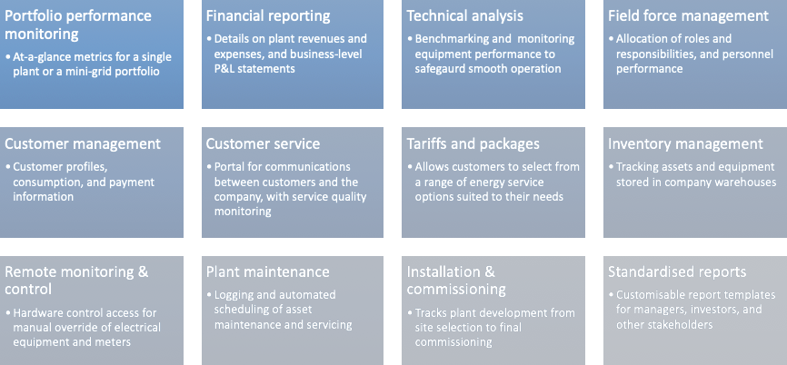
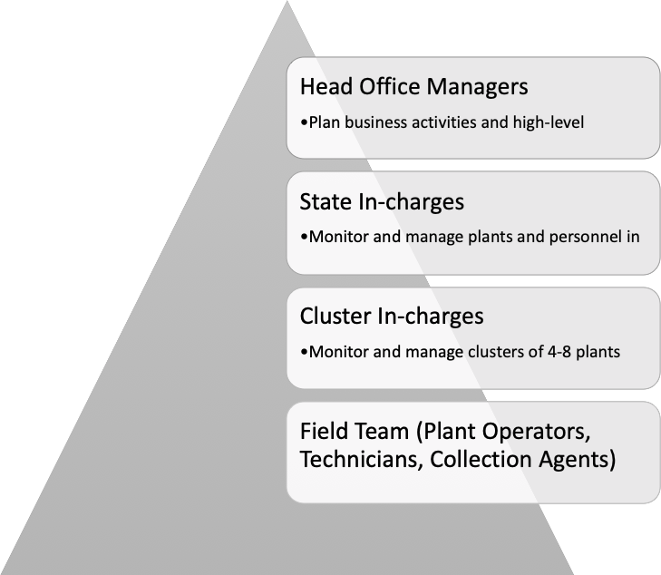

## उद्देश्य
MCOMS का लक्ष्य विभिन्न मिनी ग्रिड हितधारकों के लिए मानकीकृत वर्कफ़्लोज़, आसान-से-उपयोग इंटरफेस, थर्ड-पार्टी हार्डवेयर इंटरऑपरेबिलिटी, रैपिड और स्वचालित डेटा एकत्रीकरण, और पारदर्शी और विश्वसनीय रिकॉर्ड-रखने के माध्यम से प्रभावी ढंग से संवाद करने के लिए एक मंच प्रदान करना है।

## कार्यक्षमता
MCOMS दो महत्वपूर्ण डिजाइन सिद्धांतों पर बनाया गया है, चित्र 1 में दिखाया गया है।

| | |
| - | - |
| * ऐतिहासिक तकनीकी और वित्तीय डेटा के केंद्रीयकृत डेटाबेस, उपयोगकर्ता की जानकारी, पौधों की विशिष्टताओं, सिस्टम में बदलाव, आदि शामिल हैं * किसी भी नोड से जारी आदेशों का सटीक रूप से प्रचार और वितरण, सभी उपयोगकर्ताओं को अद्यतन जानकारी प्रदान करने के लिए |

उच्च स्तरीय प्रणाली की कार्यक्षमताएं चित्रा 2 में विस्तृत हैं।

#### चित्र 2: उच्च स्तर के पाठ्यक्रम समारोह।

MCOMS को व्यापार निगरानी के सभी पहलुओं को कवर करने के लिए डिज़ाइन किया गया है, और बिक्री और वित्त मैट्रिक्स को तकनीकी प्रदर्शन और ग्राहकों की मांग के रुझानों के विश्लेषण के साथ रखता है। सूचना के इस संश्लेषण से मिनी-ग्रिड डेवलपर्स को अपनी परियोजनाओं के संचालन की गहरी समझ मिलती है।

## उपयोगकर्ता
मिनी-ग्रिड व्यवसाय बहुआयामी हैं, जिनमें कई कर्मियों और हितधारकों की भूमिका होती है। MCOMS इन उपयोगकर्ता समूहों की आवश्यकताओं और वर्कफ़्लो को पूरा करता है, जैसा कि निम्नलिखित अनुभागों में वर्णित है।

### कंपनी कार्मिक
परिचालन दक्षता और व्यावसायिक प्रदर्शन प्राप्त करने के लिए, प्रत्येक टीम सदस्य के लिए भूमिकाओं को स्पष्ट रूप से परिभाषित करना महत्वपूर्ण है। एक मिनी-ग्रिड ऑपरेटर के कर्मियों पदानुक्रम को चित्र 3 में स्केच किया गया है, इसके बाद तालिका 1 में विस्तृत विवरण दिया गया है।

#### चित्रा 3: विशिष्ट मिनी-ग्रिड ऑपरेटर संगठनात्मक पदानुक्रम।

#### तालिका 1: मिनी-ग्रिड कर्मियों की भूमिकाओं और जिम्मेदारियों का विवरण।

<table>
  <tr>
    <th> पद </th>
    <th> भूमिका </th>
    <th> जिम्मेदारियों </th>
  </tr>
  <tr>
    <td><b> ऑपरेटर </b></td>
    <td> मिनी-ग्रिड प्लांट की देखभाल के लिए एक ऑपरेटर 24x7 मौजूद है। </ td>
	<td>
		<ul>
                  <li> सही संचालन सुनिश्चित करने के लिए संयंत्र उपकरणों की निगरानी करें </ li>
                  <li> प्लांट ट्रिप के बाद बिजली की आपूर्ति बहाल करें </ li>
                  <li> रिकॉर्ड रूटीन ऑपरेशन डेटा, जैसे प्लांट मीटर रीडिंग </ li>
		  <li> संयंत्र में आने वाले ग्राहकों की शिकायतों को संभालना </ li>
               </ ul>
	</ td>
  </tr>

  <tr>
    	<td> <b> तकनीशियन </ b> </ td>
        <td> एक तकनीशियन ग्राहकों द्वारा या संयंत्र में आए तकनीकी मुद्दों को संबोधित करता है </ td>
        <td>
		<ul>
		  <li> ग्राहक कनेक्शन समस्याओं का जवाब दें </ li>
		  <li> पूरे मिनी-ग्रिड में उपकरण के दोषों का निदान करें और उन्हें ठीक करें </ li>
		  <li> नए उपभोक्ताओं को नेटवर्क से कनेक्ट करें </ li>
		  <li> ग्राहक की ऊर्जा खपत रिकॉर्ड करें </ li>
		</ ul>
	</ td>
  </ tr>
  <tr>
	<td> <b> ग्राहक सेवा एजेंट (CSA) </ b> </ td>
	<td> एक CSA ग्राहक संबंधों का प्रबंधन करता है और बिक्री गतिविधियों का संचालन करता है </ td>
	<td>
		<ul>
		  <li> जलग्रहण क्षेत्र में संभावित ग्राहकों के लिए मिनी-ग्रिड सेवाएं और योजनाएं </ li>
		  <li> बिल जारी करें और ग्राहकों से भुगतान एकत्र करें, और जमा करें </ li>
		  <li> भुगतान न करने की स्थिति में हस्तक्षेप </ li>
		  <li> ग्राहकों की शिकायतों या कठिनाइयों का जवाब देना </ li>
		  <li> व्यवस्थापक ने पैकेज उन्नयन / डाउनग्रेड </ li> का अनुरोध किया
		</ ul>
	</ td>
  </tr>
  <tr>
	<td> <b> क्लस्टर प्रभारी </ b> </ td>
	<td> एक क्लस्टर प्रभारी पास के कई संयंत्रों में कर्मियों और संचालन का पर्यवेक्षण करता है </ td>
	<td>
		<ul>
		  <li> क्लस्टर में पौधों की बिक्री के प्रदर्शन को ट्रैक करें और समस्याओं को उजागर करें </ li>
		  <li> क्लस्टर द्वारा वहन की जाने वाली परिचालन लागतों को ट्रैक करें और सत्यापित करें </ li>
		  <li> लंबित कार्यों की निगरानी करें, और उन्हें क्षेत्र टीम के सदस्यों को आवंटित करें </ li>
		  <li> किसी रखरखाव या उपकरण प्रतिस्थापन के लिए व्यवस्था करें </ li>
		  <li> कर्मियों का प्रशिक्षण </ li> संभालें
		</ ul>
	</ td>
  </tr>
  <tr>
	<td> <b> राज्य प्रभारी </ b> </ td>
	<td> एक राज्य प्रभारी एक राज्य के भीतर सभी संयंत्रों में संचालन का पर्यवेक्षण करता है </ td>
	<td>
		<ul>
		  <li> मासिक व्यावसायिक प्रदर्शन लक्ष्य बनाएं, जिसमें राजस्व और ग्राहक संख्याएं शामिल हैं, और उनके प्रति प्रगति ट्रैक करें </ li>
		  <li> राज्य के भीतर सभी संयंत्रों के बीच योजनाओं और पहलों को समन्वित करें </ li>
		  <li> मुख्य कार्यालय के लिए बिक्री और संचालन रिपोर्ट बनाएं </ li>
		  <li> भर्ती योजना बनाएं </ li>
		  <li> समन्वय और योजना का विस्तार, निर्माण, और भर्ती </ li> योजना
		</ ul>
	</ td>
  </tr>
  <tr>
	<td> <b> प्रधान कार्यालय प्रबंधक </ b> </ td>
	<td> प्रमुख कार्यालय प्रबंधक प्रमुख निर्णयकर्ता हैं जो पोर्टफोलियो और व्यवसाय विकास का प्रबंधन करते हैं </ td>
	<td>
		<ul>
		  <li> व्यावसायिक प्रदर्शन बढ़ाने के लिए रणनीति और पहल विकसित करें </ li>
		  <li> व्यय और आय रिपोर्ट को पुनः प्राप्त करें </ li>
		  <li> तकनीकी स्वास्थ्य के क्रॉस-प्लांट विश्लेषण करें, और परिसंपत्ति पोर्टफोलियो का अनुकूलन करने के लिए हस्तक्षेप की व्यवस्था करें </ li>
		  <li> नए पैकेज और सेवाएं बनाएं </ li>
		  <li> व्यवसाय विस्तार के रणनीतिक, तकनीकी और वित्तीय तत्वों की योजना बनाएं </ li>
		</ ul>
	</ td>
  </tr>
</table>

### मिनी-ग्रिड ग्राहक
मिनी-ग्रिड की ताकत में से एक विभिन्न ऊर्जा जरूरतों और अपेक्षाओं के साथ विभिन्न प्रकार के उपभोक्ता क्षेत्रों को पूरा करने की उनकी क्षमता है। उदाहरण के लिए, जबकि एक घर में शाम को साधारण उपकरण चलाने के लिए बिजली के मामूली स्तर की आवश्यकता हो सकती है, दिन में दुकानों की पीक खपत हो सकती है, जबकि विशेष उपकरण वाले वाणिज्यिक उद्यमों को बहुत अधिक लोड भत्ता की आवश्यकता होगी।

उस ने कहा, सभी बिजली उपभोक्ता अपने बिलों और खपत के इतिहास की निगरानी करने, बिजली आपूर्तिकर्ता से अलर्ट और सूचनाएं प्राप्त करने, अपने खाते के विवरण को अपडेट करने और कुछ होने पर संपर्क में रहने की समान बुनियादी आवश्यकताओं को साझा करते हैं। MCOMS का उद्देश्य इस प्रकार के संचारों की सुविधा प्रदान करना है, और यह सुनिश्चित करना है कि ग्राहकों को उन सभी सूचनाओं और सेवा सहायता की आसान पहुँच के साथ रखा जाए जो उन्हें चाहिए।

### एक्सेस अनुमतियां
MCOMS के विभिन्न उपयोगकर्ताओं को सिस्टम के डेटाबेस और प्रबंधन कार्यक्षमता तक पहुंच के विभिन्न स्तरों की आवश्यकता होगी। जैसे, MCOMS का एक मुख्य घटक प्रत्येक उपयोगकर्ता के लिए पहुँच अनुमतियाँ सेट करने की क्षमता है। यह न केवल इंटरफ़ेस को सरल करता है, प्रत्येक उपयोगकर्ता को उनके लिए प्रासंगिक सामग्री पर ध्यान केंद्रित करने की अनुमति देता है, बल्कि यह भी सुनिश्चित करता है कि संवेदनशील डेटा सुरक्षित है।

उदाहरण के लिए:
* ग्राहकों को केवल अपने स्वयं के बिल देखने में सक्षम होना चाहिए, न कि अन्य ग्राहकों को।
* प्लांट संचालकों को केवल अपने प्लांट से संबंधित इनपुट और रिकॉर्ड डेटा में सक्षम होना चाहिए।
* रखरखाव की गतिविधियाँ और उपकरण संचालन का नियंत्रण प्लांट CSAs और तकनीशियनों के बजाय क्लस्टर या राज्य प्रभारी के हाथों में होना चाहिए।
* पोर्टफोलियो के लिए बैंक जमा और व्यय रिपोर्ट केवल ऊपरी प्रबंधन को दिखाई देनी चाहिए।

यह मैनुअल सभी MCOMS सिस्टम की विशेषताओं को प्रदर्शित करता है जो शीर्ष स्तर के उपयोगकर्ता (जैसे कि कंपनी के सीईओ) को दिखाई देगा। एक दिया गया पाठक अपने पदनाम के आधार पर इन विशेषताओं के कुछ सबसेट तक ही पहुँच सकता है; यह मामला-दर-मामला आधार पर संदर्भ से स्पष्ट होगा।

## संचार
जैसा कि पहले ही उल्लेख किया गया है, मिनी-ग्रिड व्यवसाय के सुचारू रूप से चलाने के लिए हितधारकों के बीच संचार केंद्रीय महत्व का है। उदाहरण के लिए, व्यवसाय के विभिन्न स्तरों को प्रभावी ढंग से जोड़ने के लिए, प्रधान कार्यालय में प्रबंधकों को वितरित क्षेत्र टीमों से जानकारी इकट्ठा करने की अनुमति देता है, कुशल संचालन को रेखांकित करता है।

जहाँ भी संभव हो, यह निष्क्रिय संचार के माध्यम से प्राप्त किया जाता है:
* अच्छी तरह से संरचित वर्कफ़्लो जो कार्यों को पूरा करने में उपयोगकर्ता का मार्गदर्शन करते हैं
* नियमित या अनुसूचित गतिविधियों के लिए स्वचालित रूप से उत्पन्न सूचनाएं
* आंतरिक रूप से क्रमादेशित तर्क के अनुसार सूचना का स्वचालितकरण
* तेजी से डेटा समेकन ताकि सभी उपयोगकर्ताओं को अद्यतन जानकारी उपलब्ध हो
* कुछ लेनदेन को अधिकृत करने के लिए ग्राहकों और प्रबंधकों के लिए ओटीपी

उपयोगकर्ताओं के बीच सक्रिय संचार के लिए विभिन्न तंत्र भी हैं:
* सूचनाएं और डेटा प्रविष्टि स्मार्टफोन एप्लिकेशन के माध्यम से धकेल दिया
* सूचनाएं और डेटा प्रविष्टि वेब प्लेटफॉर्म के माध्यम से धकेल दी गई
* अधिसूचना ईमेल के माध्यम से धकेल दिया
* सूचनाएं और अनुरोध एसएमएस के माध्यम से धकेल दिया

मल्टी-मोडल संचार विशेष रूप से महत्वपूर्ण हैं जब विभिन्न उपयोगकर्ताओं की अलग-अलग प्राथमिकताएँ होंगी। उदाहरण के लिए, जो ग्राहक स्मार्टफोन ऐप का उपयोग नहीं कर सकते हैं उन्हें एसएमएस के माध्यम से बिल, रसीदें और सूचनाएं प्राप्त होंगी।